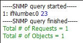

# GRX - SNMP

> Auteurs : Jérôme Arn & Doran Kayoumi

## Objectif 2 - Configurer un «SNMP Manager»

Après avoir installé `SNMPb`, on voit bien que le profile host `localhost` existe déjà.

## Objectif 3 - Configurer les agents SNMP en mode v2

### Activer SNMP sur Win A

Affin d'activer l’agent SNMP, Il suffit d'ouvrir le `panneau de configuration`, ouvrir la section `Programmes et fonctionnalités` où l'on peut activer ou désactiver les fonctionnalités de Windows. Ensuite depuis la fenêtre `Fonctionnalités de Windows`, il suffit de cocher `Protocole SNMP (Simple Network Management Protocol)`.

Pour configurer le service, il faut ouvrir `services.msc` (en administrateur). Afin de s'assurer que le service tourne en permanence, il faut définir un `type de démarrage` **automatique**.

Ensuite, on peut configurer le service (clic droit `Propriété`).

|                                          |                                          |
| ---------------------------------------- | ---------------------------------------- |
|  |  |

Ensuite depuis `SNMPb`, on peut "découvrir" le nouvel agent.

### 5 objets SNMP

**TODO**

### Modification de Win A pour interroger Win B

Pour permettre la machine Win A d'interroger la machine Win B, il suffit d'ajouter un nouveau `Agent Profiles`  en lui spécifiant l'adresse IP de Win B. Et finalement, il faut changer la valeur de la `community string RO` à **not-public**.

| Agent Profiles                       | Community string                     |
| ------------------------------------ | ------------------------------------ |
|  |  |

Ensuite, lors de la configuration de Win B, il a fallut ajouter Win A (192.168.1.3) dans la liste des hôtes pouvant envoyer des paquets SNMP.

Et maintenant, si l'on interroge l'agent Win B afin d'obtenir la `description système`, on vois que l'on reçoit bien une réponse.

### Interrogation de Win B

> Nom de l'équipement

> Nom du responsable de l'équipement

> Modèle de l'équipement

> Nombre d’interfaces de l'équipement

| N°   | Octets rentrant | Octets sortant |
| ---- | --------------- | -------------- |
| 1    |                 |                |
| 2    |                 |                |
| 3    |                 |                |
| 4    |                 |                |
| 5    |                 |                |
| 6    |                 |                |
| 7    |                 |                |
| 8    |                 |                |
| 9    |                 |                |

> Trafic sur chaque interfaces 

## Objectif 4 - MIBs privées

Afin d’interroger des objets spécifiques à votre équipement, vous avez besoin d’intégrer à votre manager SNMP (l’application SNMPb) les MIB privées nécessaires.Vous désirez obtenir des informations sur la mémoire flash embarquée sur votre routeur: chargez les MIBs privées nécessaires

> donnez la liste des MIBs que vous avez chargé.

> montrez le résultat obtenu en effectuant un requête depuis l’application SNMPb

## Objectif 5 - Configurer les agents SNMP en mode v3

> Modifiez la configuration de votre router afin qu’il n’accepte plus que des requête SNMPv3.

> Configurez votre application SNMPb en conséquence et montrer le résultat d’une requête sur la valeur SysUpTime (MIB-2

> Capturez/analysez les messages lors d’une requête SNMPv3