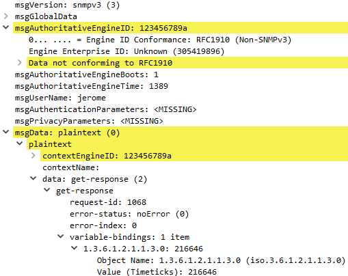

# GRX - SNMP

> Auteurs : Jérôme Arn & Doran Kayoumi

## Objectif 2 - Configurer un «SNMP Manager»

Après avoir installé `SNMPb`, on voit bien que le profile host `localhost` existe déjà.


## Objectif 3 - Configurer les agents SNMP en mode v2

### Activer SNMP sur Win A

Affin d'activer l’agent SNMP, Il suffit d'ouvrir le `panneau de configuration`, ouvrir la section `Programmes et fonctionnalités` où l'on peut activer ou désactiver les fonctionnalités de Windows. Ensuite depuis la fenêtre `Fonctionnalités de Windows`, il suffit de cocher `Protocole SNMP (Simple Network Management Protocol)`.


Pour configurer le service, il faut ouvrir `services.msc` (en administrateur). Afin de s'assurer que le service tourne en permanence, il faut définir un `type de démarrage` **automatique**.


Ensuite, on peut configurer le service (clic droit `Propriété`).

|                                          |                                          |
| ---------------------------------------- | ---------------------------------------- |
|  |  |

Ensuite depuis `SNMPb`, on peut "découvrir" le nouvel agent.


### 5 objets SNMP


### Modification de Win A pour interroger Win B

Pour permettre la machine Win A d'interroger la machine Win B, il suffit d'ajouter un nouveau `Agent Profiles`  en lui spécifiant l'adresse IP de Win B. Et finalement, il faut changer la valeur de la `community string RO` à **not-public**.

| Agent Profiles                       | Community string                     |
| ------------------------------------ | ------------------------------------ |
|  |  |

Ensuite, lors de la configuration de Win B, il a fallut ajouter Win A (192.168.1.3) dans la liste des hôtes pouvant envoyer des paquets SNMP.


Et maintenant, si l'on interroge l'agent Win B afin d'obtenir la `description système`, on vois que l'on reçoit bien une réponse.


### Interrogation de Win B


> Nom de l'équipement


> Nom du responsable de l'équipement


> Modèle de l'équipement


> Nombre d’interfaces de l'équipement

| N°   | Octets rentrant | Octets sortant |
| ---- | --------------- | -------------- |
| 1    | 0               |                |
| 2    | 0               |                |
| 3    | 0               |                |
| 4    | 0               |                |
| 5    | 0               |                |
| 6    | 0               |                |
| 7    | 0               |                |
| 8    | 0               |                |
| 9    | 0               |                |
| 10   | 0               |                |
| 11   | 0               |                |
| 12   | 0               |                |
| 13   | 0               |                |
| 14   | 4430692         |                |
| 15   | 4433265         |                |
| 16   | 11395430        |                |
| 17   | 24910978        |                |
| 18   | 0               |                |
| 19   | 0               |                |
| 20   | 0               |                |
| 21   | 0               |                |
| 22   | 0               |                |
| 23   | 0               |                |


> Trafic sur chaque interfaces 


> A l’aide de Wireshark, capturez et présentez de manière lisible les trames lorsque la machine Windows 10 A interroge la machine Windows 10 B pour obtenir le nom de l’équipement (les champs concernant SNMP doivent être visibles et commentés). 


On peut voir que dans la requête, on retrouve l'Oid de sysName **1.3.6.1.2.1.1.5**.


Et dans la réponse, on a le nom de la machine dans le champ **variable-binding-string**.

### Activer et configurez l’agent SNMP sur le routeur Cisco

> Configurez le routeur cisco de manière à pouvoir le gérer via SNMPv2 (choisissez « cisco » pour community string RO et « ciscor » pour community string RW). Configurez également le routeur pour qu’il envoie ses traps snmp au manager.


> Créez un nouveau profil dans l’application SNMPb pour pouvoir gérer votre routeur.


> Changez le nom du routeur à l’aide de l’application  SNMPb (nouveau nom : router<votre-nom>) tout en capturant/analysant les messages échangés à l’aide de Wireshark


> Que pouvez-vous dire sur la sécurité du protocole SNMPv2 ? Citez deux moyens d’améliorer la sécurité de notre infrastructure. 

Ce n'est pas sécurisé car les messages ne sont pas authentifié. et les messages sont transmis en clair sur le réseau. 

- Chiffrer les données transmissent sur le réseau
- authentification des messages  

Passer à la version 3 de SNMP si l'équipement le supporte car il y a de l'authentification. (et à voir pour le chiffrement)

> Générez une trap SNMP en déclenchant un événement sur votre routeur (un peu d’imagination...) et vérifiez que vous récupérez bien la « SNMP trap » sur l’application SNMPb.


> Analysez les trames de la capture précédente et décodez la signification des différents messages SNMP en recherchant la signification du « OID code » à l’aide du SNMP Object Navigator Cisco https://mibs.cloudapps.cisco.com/ITDIT/MIBS/servlet/index (compte Cisco à créer si nécessaire)


### Windows Powershell permet de créer des scripts, utiles pour récupérer des informations de manière régulière et automatisée par exemple.

> Récupérez le nom de votre routeur à l’aide de la cmdlet  adéquate.

```powershell
PS> Get-SNMP 192.168.1.1 sysName.0 -Community cisco
```

> Configurez le routeur de manière à ce qu’il n’accepte des requêtes SNMP que de la part de votre machine Windows 10 A uniquement. Validez votre configuration en vérifiant que votre machine Windows 10 B n’y a plus accès.

````sh
access-list 99 permit 192.168.1.3
access-list 99 deny any
snmp-server community cisco ro 99
snmp-server community ciscorw rw 99
````

On peut constater que les requêtes sur la machine WinB aboutissent à un timeout.

## Objectif 4 - MIBs privées

Afin d’interroger des objets spécifiques à votre équipement, vous avez besoin d’intégrer à votre manager SNMP (l’application SNMPb) les MIB privées nécessaires. Vous désirez obtenir des informations sur la mémoire flash embarquée sur votre routeur: chargez les MIBs privées nécessaires

> donnez la liste des MIBs que vous avez chargé.


> montrez le résultat obtenu en effectuant un requête depuis l’application SNMPb

## Objectif 5 - Configurer les agents SNMP en mode v3

> Modifiez la configuration de votre router afin qu’il n’accepte plus que des requête SNMPv3.

````sh
snmp-server view ViewDefault iso included
snmp-server group GRX v3 priv read ViewDefault
snmp-server user jerome GRX v3 auth sha password priv des privacyPassword
# pour supprimer l'usage de la version 1 et 2
no snmp-server community cisco 
no snmp-server community ciscorw 
````

On constate que si on fait des requêtes sur le router en version 1 et 2, il y a désormais un timeout qui apparaît. 

> Configurez votre application SNMPb en conséquence et montrer le résultat d’une requête sur la valeur SysUpTime (MIB-2)

Il faut d'abord créer un profil user SNMPV3. Puis dans le profil du router, cochez la case **SNMPV3**. 


Dans l'onglet SnmpV3 du profil du router, sélectionner le security name qui a été paramétré auparavant ainsi que le type authentification.


> Capturez/analysez les messages lors d’une requête SNMPv3

On peut aussi voir que dans la requête, les données du messages sont transmissent en clair. 


 

On constate que la version snmpV3 est notifié dans l'entête. Puis on voit que le nom d'utilisateur est en clair contrairement au mot de passe d'authentification et au mot de passe de privacy. On peut aussi voir que les données du message sont chiffrées 

